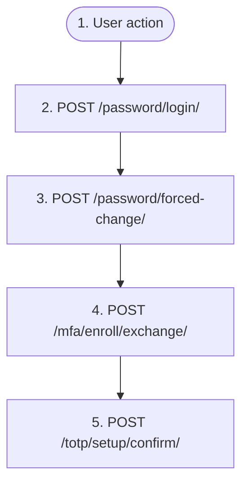

# First login of an org-provisioned account

`auth.first_login`

**Actors:** Org-provisioned user

An organization admin provisioned the account (auth.provision_user: namespaced username org_slug/local, org-set or server-generated password, a first-login policy flag). The first password login returns FIRST_LOGIN_REQUIRED with a 10-minute challenge_token instead of a session: requires=password_change routes to the forced password change, requires=mfa_enroll to a limited enroll-only session in which only TOTP setup/confirm, passkey registration and logout are allowed. Completing the step clears the flag and yields a full session; when both flags are set, the password change chains straight into the mfa_enroll challenge.

## Flow diagram

## Steps

1. **User action** — The org admin hands over the namespaced login (org_slug/username) and the initial password out of band
2. **POST `/password/login/`** — Sign in with the provisioned credentials; while a first-login flag is up the response is FIRST_LOGIN_REQUIRED {requires, challenge_token} instead of tokens
3. **POST `/password/forced-change/`** — requires=password_change: set an own password (validated by the password canon); returns a full session — or the next FIRST_LOGIN_REQUIRED (requires=mfa_enroll) when both flags are set. A rejected password does not consume the challenge
4. **POST `/mfa/enroll/exchange/`** — requires=mfa_enroll: exchange the challenge_token for a limited enroll-only session (JWT claim enroll_only, access token only — no refresh); every endpoint outside the enrollment surface answers 403 mfa_enrollment_required
5. **POST `/totp/setup/confirm/`** — Enroll the strong factor: confirming TOTP setup (or completing a passkey registration) clears the flag, emits user.mfa_enabled and returns the full-session token pair in the same response

## Endpoints

| Step | Method | Path | Request | Response | Step-up verification |
|---|---|---|---|---|---|
| 2 | POST | `/password/login/` | — | — | — |
| 3 | POST | `/password/forced-change/` | — | — | — |
| 4 | POST | `/mfa/enroll/exchange/` | — | — | — |
| 5 | POST | `/totp/setup/confirm/` | — | — | — |
