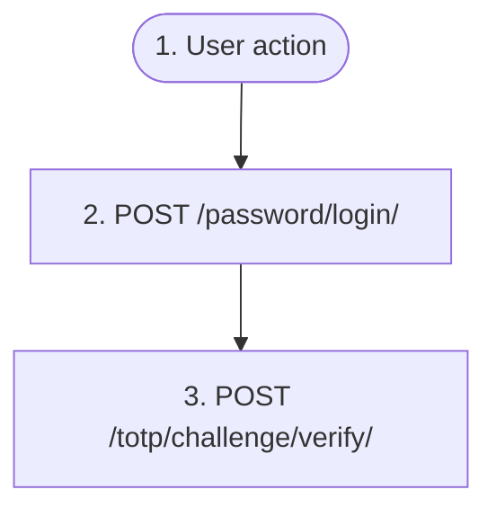

# Password login (+ optional TOTP)

`auth.password_login`

**Actors:** Anonymous user

The user signs in with a login (email/username) and password. The endpoint is enabled by the AUTH_PASSWORD_LOGIN setting. Failed attempts lead to progressive lockout (423 with retry_after). If the user has TOTP enabled and the PASSWORD_LOGIN_STEP_UP setting is active (default: yes), TOTP_REQUIRED with a challenge_token is returned instead of tokens — the session is issued only after the authenticator code is verified.

## Flow diagram

## Steps

1. **User action** — The user enters their login and password on the login form
2. **POST `/password/login/`** — Verify the password; 423 when locked out; with TOTP enabled and PASSWORD_LOGIN_STEP_UP — a TOTP_REQUIRED response with a challenge_token
3. **POST `/totp/challenge/verify/`** — Optional step (only on TOTP_REQUIRED): exchange the challenge_token and the authenticator code for a JWT session

## Endpoints

| Step | Method | Path | Request | Response | Step-up verification |
|---|---|---|---|---|---|
| 2 | POST | `/password/login/` | — | — | — |
| 3 | POST | `/totp/challenge/verify/` | — | — | — |
