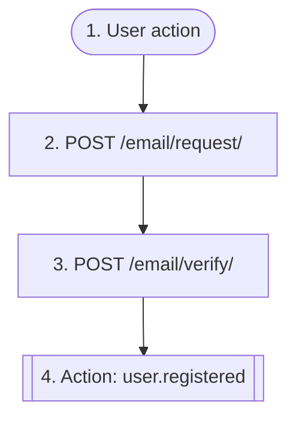

# Passwordless login (email OTP)

`auth.passwordless_login`

**Actors:** Anonymous user

An anonymous user receives a one-time code by email and exchanges it for a JWT session (cookies + a token pair in the response body). Requesting the code again is rate-limited (30 seconds between sends; 429/422 when exceeded); after a series of wrong codes the address is temporarily locked. If the address was not registered, the first successful login creates a new user (status=REGISTERED instead of LOGGED_IN).

## Flow diagram

## Steps

1. **User action** — The user enters their email on the login form
2. **POST `/email/request/`** — Request a one-time code by email; 429 on rate limit, 422 when the address is locked
3. **POST `/email/verify/`** — Exchange the code for a JWT session; a wrong code decrements the attempt counter
4. **Action `user.registered`** — Emitted on first login — the profile and workspace are created by subscribers

## Endpoints

| Step | Method | Path | Request | Response | Step-up verification |
|---|---|---|---|---|---|
| 2 | POST | `/email/request/` | — | — | — |
| 3 | POST | `/email/verify/` | — | — | — |
