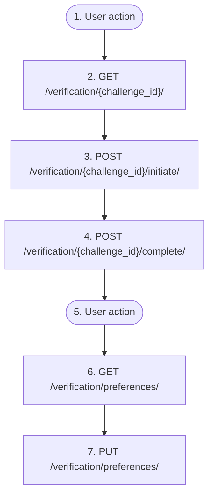

# Step-up verification on a protected endpoint (reference flow)

`auth.step_up_verification`

**Actors:** Authenticated user

THE reference flow of the step-up verification contract (stapel_core.verification, see flows-and-verification.md §2) — clients of any service implement it once and reuse it for every endpoint protected by @requires_verification. The cycle: the protected endpoint responds 403 with a structured verification envelope (challenge_id, scope, factors, expires_at) → the client reads the challenge, picks an available factor (factors are interchangeable: otp_email, otp_phone, totp, passkey all close one challenge), initiates it and completes the check → repeats the original request. The grant is stored server-side (cache, user+scope key, TTL=max_age); stateless clients may instead send the X-Verification-Token header from the completion response. After MAX_ATTEMPTS wrong attempts the challenge burns out (423) — call the original endpoint again for a new challenge.

## Flow diagram

## Steps

1. **User action** — The client calls the protected endpoint and receives 403 with a verification envelope: challenge_id, scope, factors, expires_at
2. **GET `/verification/<str:challenge_id>/`** — Read the challenge: the scope and the factors filtered down to those actually available to the user; 404 for a foreign/expired challenge
3. **POST `/verification/<str:challenge_id>/initiate/`** — Initiate the chosen factor: send a code (otp_email/otp_phone) or get WebAuthn options (passkey); totp needs no initiation
4. **POST `/verification/<str:challenge_id>/complete/`** — Complete the challenge with the factor proof; success = {verified, verification_token} + a server-side grant; 400 on a wrong code, 423 when the challenge burned out from brute force
5. **User action** — Repeat the original request — the grant is already on the server; a stateless client sends the X-Verification-Token from the completion response
6. **GET `/verification/preferences/`** — Optional: view your step-up preferences — one {scope, enabled} row per scope the user has touched (enabled=false disables a default_on scope, enabled=true enables an opt_in scope; strict endpoints ignore the preferences)
7. **PUT `/verification/preferences/`** — Optional: change a {scope, enabled} preference. INVARIANT: disabling (enabled=false) is itself protected by @requires_verification(scope=verification.settings, level=default_on) — without a fresh grant a 403 with a verification envelope is returned; enabling requires no step-up confirmation. Both writes reset the policy cache in core

## Endpoints

| Step | Method | Path | Request | Response | Step-up verification |
|---|---|---|---|---|---|
| 2 | GET | `/verification/<str:challenge_id>/` | — | — | — |
| 3 | POST | `/verification/<str:challenge_id>/initiate/` | — | — | — |
| 4 | POST | `/verification/<str:challenge_id>/complete/` | — | — | — |
| 6 | GET | `/verification/preferences/` | — | — | — |
| 7 | PUT | `/verification/preferences/` | — | — | — |
