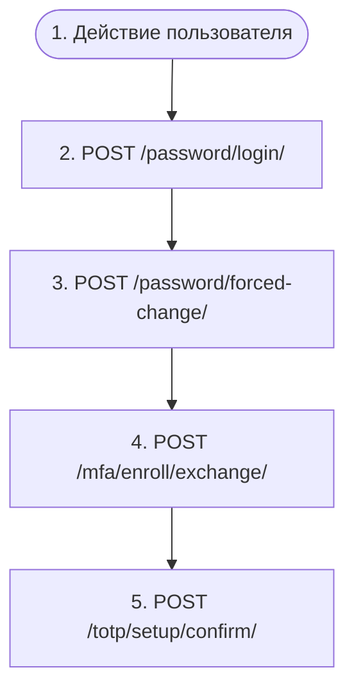

# Первый вход орг-провиженной учётной записи

`auth.first_login`

**Актор(ы):** Org-provisioned user

Администратор организации создал учётную запись (auth.provision_user: неймспейсный логин org_slug/local, пароль от организации или сгенерированный сервером, флаг политики первого входа). Первый вход по паролю возвращает FIRST_LOGIN_REQUIRED с 10-минутным challenge_token вместо сессии: requires=password_change ведёт к обязательной смене пароля, requires=mfa_enroll — к ограниченной enroll-сессии, в которой доступны только настройка/подтверждение TOTP, регистрация ключа доступа и выход. Завершение шага снимает флаг и выдаёт полную сессию; если выставлены оба флага, смена пароля сразу переходит в челлендж mfa_enroll.

## Диаграмма флоу

## Шаги

1. **Действие пользователя** — Администратор организации передаёт неймспейсный логин (org_slug/username) и первоначальный пароль вне системы
2. **POST `/password/login/`** — Вход с выданными учётными данными; пока выставлен флаг первого входа, в ответ приходит FIRST_LOGIN_REQUIRED {requires, challenge_token} вместо токенов
3. **POST `/password/forced-change/`** — requires=password_change: установка собственного пароля (проверяется по канону паролей); возвращается полная сессия — или следующий FIRST_LOGIN_REQUIRED (requires=mfa_enroll), если выставлены оба флага. Отклонённый пароль не расходует челлендж
4. **POST `/mfa/enroll/exchange/`** — requires=mfa_enroll: обмен challenge_token на ограниченную enroll-сессию (JWT-клейм enroll_only, только access-токен — без refresh); все эндпоинты вне поверхности enrollment отвечают 403 mfa_enrollment_required
5. **POST `/totp/setup/confirm/`** — Подключение сильного фактора: подтверждение настройки TOTP (или завершение регистрации ключа доступа) снимает флаг, эмитит user.mfa_enabled и возвращает пару токенов полной сессии в том же ответе

## Эндпоинты

| Шаг | Метод | Путь | Запрос | Ответ | Step-up-верификация |
|---|---|---|---|---|---|
| 2 | POST | `/password/login/` | — | — | — |
| 3 | POST | `/password/forced-change/` | — | — | — |
| 4 | POST | `/mfa/enroll/exchange/` | — | — | — |
| 5 | POST | `/totp/setup/confirm/` | — | — | — |
