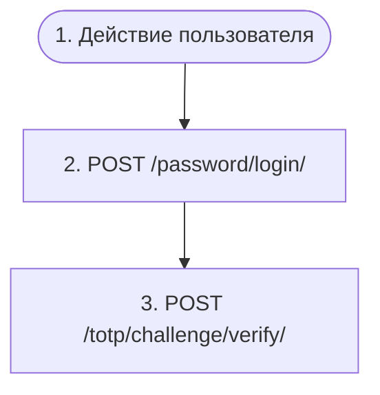

# Вход по паролю (+ опциональный TOTP)

`auth.password_login`

**Актор(ы):** Anonymous user

Пользователь входит по логину (email/username) и паролю. Эндпоинт включается настройкой AUTH_PASSWORD_LOGIN. Неудачные попытки ведут к прогрессивной блокировке (423 c retry_after). Если у пользователя включён TOTP и настройка PASSWORD_LOGIN_STEP_UP активна (по умолчанию да), вместо токенов возвращается TOTP_REQUIRED c challenge_token — сессия выдаётся только после проверки кода аутентификатора.

## Диаграмма флоу

## Шаги

1. **Действие пользователя** — Пользователь вводит логин и пароль на форме входа
2. **POST `/password/login/`** — Проверить пароль; 423 при блокировке; при включённом TOTP и PASSWORD_LOGIN_STEP_UP — ответ TOTP_REQUIRED c challenge_token
3. **POST `/totp/challenge/verify/`** — Опциональный шаг (только при TOTP_REQUIRED): обменять challenge_token и код аутентификатора на JWT-сессию

## Эндпоинты

| Шаг | Метод | Путь | Запрос | Ответ | Step-up-верификация |
|---|---|---|---|---|---|
| 2 | POST | `/password/login/` | — | — | — |
| 3 | POST | `/totp/challenge/verify/` | — | — | — |
