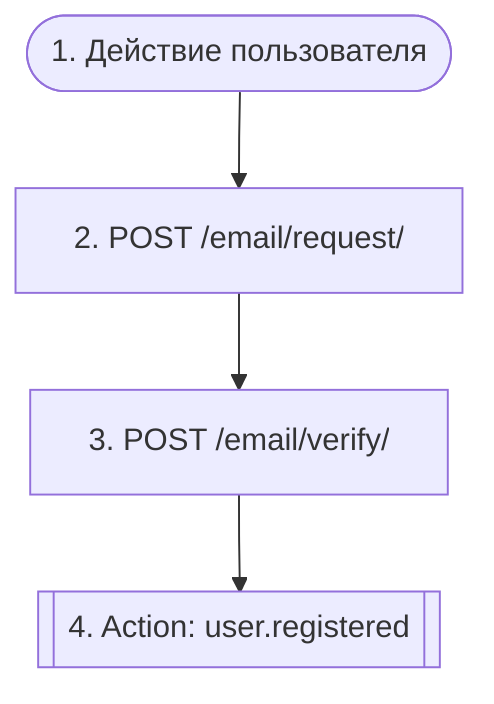

# Вход без пароля (email OTP)

`auth.passwordless_login`

**Актор(ы):** Anonymous user

Анонимный пользователь получает одноразовый код на почту и обменивает его на JWT-сессию (cookies + пара токенов в теле ответа). Повторный запрос кода ограничен рейт-лимитом (30 секунд между отправками, 429/422 при превышении); после серии неверных кодов адрес временно блокируется. Если адрес не был зарегистрирован, при первом успешном входе создаётся новый пользователь (status=REGISTERED вместо LOGGED_IN).

## Диаграмма флоу

## Шаги

1. **Действие пользователя** — Пользователь вводит email на форме входа
2. **POST `/email/request/`** — Запросить одноразовый код на email; 429 при рейт-лимите, 422 при блокировке
3. **POST `/email/verify/`** — Обменять код на JWT-сессию; неверный код уменьшает счётчик попыток
4. **Action `user.registered`** — Эмитится при первом входе — профиль и воркспейс создаются подписчиками

## Эндпоинты

| Шаг | Метод | Путь | Запрос | Ответ | Step-up-верификация |
|---|---|---|---|---|---|
| 2 | POST | `/email/request/` | — | — | — |
| 3 | POST | `/email/verify/` | — | — | — |
