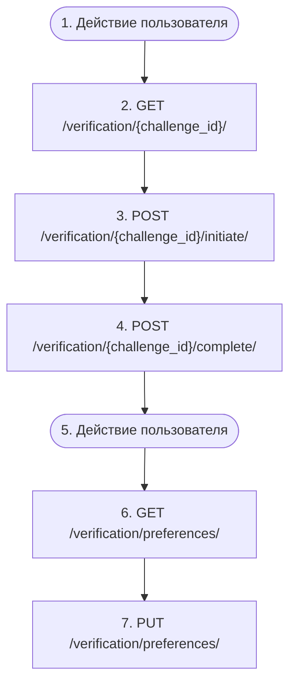

# Step-up-верификация на защищённом эндпоинте (референсный флоу)

`auth.step_up_verification`

**Актор(ы):** Authenticated user

РЕФЕРЕНСНЫЙ флоу контракта step-up-верификации (stapel_core.verification, см. flows-and-verification.md §2) — клиенты любого сервиса реализуют его один раз и переиспользуют для всех эндпоинтов, защищённых @requires_verification. Цикл: защищённый эндпоинт отвечает 403 со структурированным конвертом verification (challenge_id, scope, factors, expires_at) → клиент читает challenge, выбирает доступный фактор (факторы взаимозаменяемы: otp_email, otp_phone, totp, passkey закрывают один challenge), инициирует его и завершает проверку → повторяет исходный запрос. Grant хранится сервер-сайд (cache, ключ user+scope, TTL=max_age); stateless-клиенты могут вместо этого прислать заголовок X-Verification-Token из ответа завершения. После MAX_ATTEMPTS неверных попыток challenge сгорает (423) — нужно снова вызвать исходный эндпоинт за новым challenge.

## Диаграмма флоу

## Шаги

1. **Действие пользователя** — Клиент вызывает защищённый эндпоинт и получает 403 с конвертом verification: challenge_id, scope, factors, expires_at
2. **GET `/verification/<str:challenge_id>/`** — Прочитать challenge: scope и факторы, отфильтрованные до реально доступных пользователю; 404 для чужого/истёкшего challenge
3. **POST `/verification/<str:challenge_id>/initiate/`** — Инициировать выбранный фактор: отправить код (otp_email/otp_phone) или получить WebAuthn-опции (passkey); totp инициации не требует
4. **POST `/verification/<str:challenge_id>/complete/`** — Завершить challenge доказательством фактора; успех = {verified, verification_token} + grant сервер-сайд; 400 при неверном коде, 423 когда challenge сгорел от перебора
5. **Действие пользователя** — Повторить исходный запрос — grant уже на сервере; stateless-клиент передаёт X-Verification-Token из ответа завершения
6. **GET `/verification/preferences/`** — Опционально: посмотреть свои step-up-настройки — по строке {scope, enabled} на каждый scope, который пользователь трогал (enabled=false выключает default_on-scope, enabled=true включает opt_in-scope; strict-эндпоинты настройки игнорируют)
7. **PUT `/verification/preferences/`** — Опционально: изменить настройку {scope, enabled}. ИНВАРИАНТ: выключение (enabled=false) само защищено @requires_verification(scope=verification.settings, level=default_on) — без свежего grant'а придёт 403 с конвертом verification; включение step-up-подтверждения не требует. Обе записи сбрасывают кэш политики в core

## Эндпоинты

| Шаг | Метод | Путь | Запрос | Ответ | Step-up-верификация |
|---|---|---|---|---|---|
| 2 | GET | `/verification/<str:challenge_id>/` | — | — | — |
| 3 | POST | `/verification/<str:challenge_id>/initiate/` | — | — | — |
| 4 | POST | `/verification/<str:challenge_id>/complete/` | — | — | — |
| 6 | GET | `/verification/preferences/` | — | — | — |
| 7 | PUT | `/verification/preferences/` | — | — | — |
